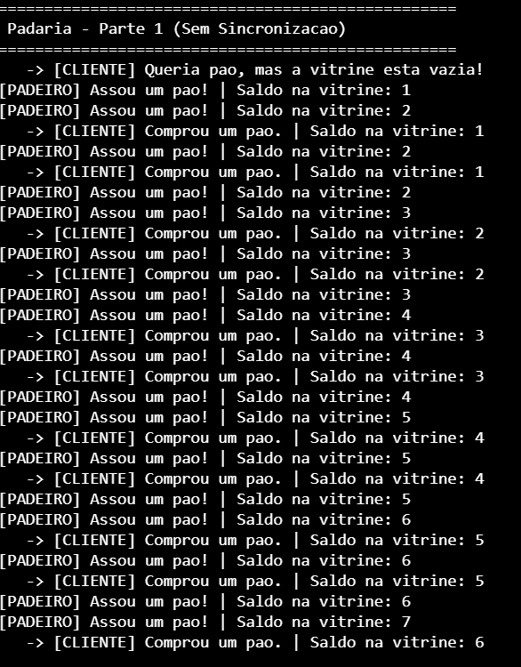

# ### Objetivo

Esta atividade explora o compartilhamento de recursos entre múltiplas threads e o uso de mecanismos de sincronização para evitar inconsistências.

Implemente uma simulação de uma padaria:

- Um **padeiro** (Thread 1) produz pães e os coloca na vitrine.
- Um **cliente** (Thread 2) retira pães da vitrine.
- A vitrine é representada por uma variável compartilhada `saldo_vitrine`.

---

## Parte 1 – Sem sincronização

### Regras

- O padeiro produz um pão a cada 1 segundo.
- O cliente tenta retirar um pão a cada 1,5 segundos.
- A quantidade de pães disponíveis é armazenada em `saldo_vitrine`.
    - Produção: `saldo_vitrine++`
    - Consumo: `saldo_vitrine--`
- Não utilize mutexes, semáforos ou filas.

### Observação

Execute o programa e responda:

1. O saldo da vitrine permanece consistente?

R.: Como a velocidade de produção é superior à de consumo, o saldo da vitrine é crescente.

2. O saldo pode se tornar negativo?

R.: Neste caso o saldo nunca se torna negativo pois a velocidade de produção do pão é superior à velocidade de consumo pelo cliente.

3. O comportamento muda ao alterar os tempos das threads?

R.: Se o tempo de produção continuar sendo superior ao de consumo, o comportamento crecente do saldo da vitrine se mantém. Porém se o cliente consumir mais pães ou se comprar a mesma quantidade em menos tempo, ou seja, aumentar a velocidade de consumo em pães/s o comportamento mudará.

4. O comportamento muda ao alterar as prioridades das threads?

R.: Caso se altere a prioridade das threads, o comportamento não se altera pois a velocidade de produção e de consumo é que comandam o comportamento crescente do saldo da vitrine neste caso.

5. Quais problemas podem ocorrer quando duas threads acessam a mesma variável simultaneamente?

R.: Nos segundos múltiplos de 3 (3, 6, 9, 12...) há a produção e a compra de pães. Como ambas tem a mesma prioridade, um problema que se pode ter é um ser mais rápido que o outro. Se o cliente for mais rápido, ele irá subtrair o saldo atual de pães no segundo 3, o que faz o estoque ficar com 1 pão ao invés de 2 com a nova produção do padeiro. Caso o padeiro seja mais rápido, o saldo da vitrine será maior que deveria ser em 1 unidade. Tanto em um quanto no outro, o saldo pode é afetado em 1 unidade a mais ou a menos se ambos forem ativados ao mesmo tempo.

---

## Parte 2 – Utilizando Mutex

Adicione um mutex para proteger o acesso à variável `saldo_vitrine`.

### Observação

Execute novamente o programa e responda:

1. O mutex eliminou os problemas observados na Parte 1?

R.:Sim, pois o mutex funciona como uma barreira que impede o acesso e a alteração simultânea de uma mesma variável, impedindo a soma ou subtração do saldo de pães de forma indevida. Através da variável "vitrine", o "saldo_vitrine" é protegido quando o primeiro (padeiro ou cliente) bloqueia a vitrine e impede o acesso da outro ao saldo até o desbloqueio dela.

2. O mutex impede que o cliente retire pão de uma vitrine vazia?

R.: Não, o mutex apenas impede o acesso simultâneo indevido de variáveis.

3. Qual é exatamente o recurso protegido pelo mutex?

R.: O principal recurso protegido pelo mutex é o saldo corrente de pães da padaria. 

4. Qual é a principal função de um mutex neste problema?

R.: Principalmente nos tempos múltiplos de 3, o mutex impede a compra e a adição simultânea ou a compra anterior à adição de um novo pão, impedindo a quebra de lógica.

## Parte 3 – Utilizando Semáforos

Modifique o programa para utilizar semáforos.

Considere que:

- A vitrine possui capacidade máxima de 10 pães.
- O cliente só pode retirar pão quando houver pães disponíveis.
- O padeiro só pode produzir quando houver espaço livre na vitrine.

### Observação

Execute novamente o programa e responda:

1. O saldo pode se tornar negativo?

R.: O uso de semáforos impede um saldo negativo para a quantidade de pães.

2. O saldo pode ultrapassar a capacidade da vitrine?

R.: O uso de semáforos impede que a produção cause uma quantidade maior que 10 unidades de pães na padaria na definição "K_SEM_DEFINE(saldo_vitrine, 0, saldoMax)", em que 0 é o valor inicial e mínimo e o saldoMax é a o teto de 10 pães.

3. Qual problema foi resolvido pelos semáforos que não era resolvido apenas pelo mutex?

R.: Os semáforos não só bloqueam o acesso indevido à variável "saldo_vitrine", mas resolve o problema da quantidade negativa ou maior que um limite estipulado que o mutex não é capaz de solucionar.

4. Qual é o papel de cada semáforo utilizado?

---

## Comparação

Explique:

1. Qual a diferença entre proteger um recurso e controlar sua disponibilidade?
2. Em qual parte da atividade o mutex foi suficiente?
3. Em qual parte os semáforos se mostraram mais adequados?
4. Se fosse necessário implementar uma padaria real, você utilizaria mutex, semáforos ou ambos? Justifique.

---

## Entrega

- Código da Parte 1.
- Código da Parte 2.
- Código da Parte 3.
- Respostas às perguntas de observação e comparação.